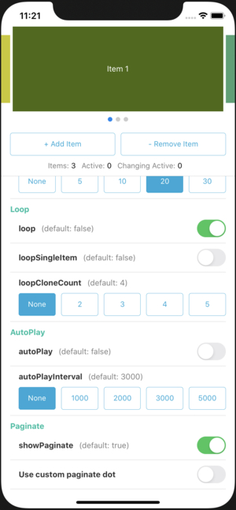

# React Native Bit Swiper

[](https://www.npmjs.com/package/react-native-bit-swiper)

다양한 기능을 제공하는 React Native 용 Swiper 컴포넌트입니다.

- [`루프(Loop)`](docs/Examples.md#루프-loop), [`자동 스크롤(Autoplay)`](docs/Examples.md#자동-스크롤-autoplay) 기능을 제공합니다.
- 커스텀 가능한 [`페이지(Paginate)`](docs/Examples.md#페이지-스타일) 기능을 제공합니다.
- 활성/비활성 아이템의 스케일(Scale), 투명도(Opacity) 설정을 포함한 [`비활성 아이템 표시`](docs/Examples.md#비활성-아이템-표시) 기능을 제공합니다.
- [`아이템 정렬`](docs/Examples.md#아이템-정렬), [`아이템 스케일 정렬`](docs/Examples.md#아이템-스케일-정렬) 기능을 제공합니다.
- 다양한 기능을 실시간으로 테스트할 수 있는 [`예제 프로그램`](docs/Examples.md#예제-프로그램)을 제공합니다.

## 설치
```
npm install --save react-native-bit-swiper
```
or
```
yarn add react-native-bit-swiper
```

## 사용
```javascript
import BitSwiper from 'react-native-bit-swiper';

<BitSwiper
  items={['Item 1', 'Item 2', 'Item 3']}
  onItemRender={(item) => (
    <View style={{height: 200}}>
      <Text>{item}</Text>
    </View>
  )}
/>
```

## 문서
- [API 명세서 (API Reference)](./docs/ApiReference.md) : 사용 가능한 Props, Event, Method 에 대한 상세 정보를 제공합니다.
- [예제 (Examples)](./docs/Examples.md) : 다양한 예제 및 코드를 제공합니다.

## 예제
[예제 (Examples)](./docs/Examples.md) 문서에서 다양한 예제 및 코드를 확인할 수 있습니다.

> [`기본`](./docs/Examples.md#기본) 
>
> 

> [`비활성 아이템 표시`](./docs/Examples.md#비활성-아이템-표시)
>
> 

> [`루프 (Loop)`](./docs/Examples.md#루프-loop)
>
> 

> [`자동 스크롤 (Autoplay)`](./docs/Examples.md#자동-스크롤-autoplay)
> 
> 
>
> 

> [`페이지 스타일`](./docs/Examples.md#페이지-스타일)
> 
> 

> [`커스텀 페이지`](./docs/Examples.md#커스텀-페이지)
> 
> 

> [`아이템 정렬`](./docs/Examples.md#아이템-정렬)
> 
> 
> 
> 
> 
> 

> [`아이템 스케일 정렬`](./docs/Examples.md#아이템-스케일-정렬)
> 
> 
> 
> 
> 
> 

> [`예제 프로그램`](./docs/Examples.md#예제-프로그램)
> 
> 
