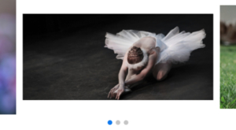
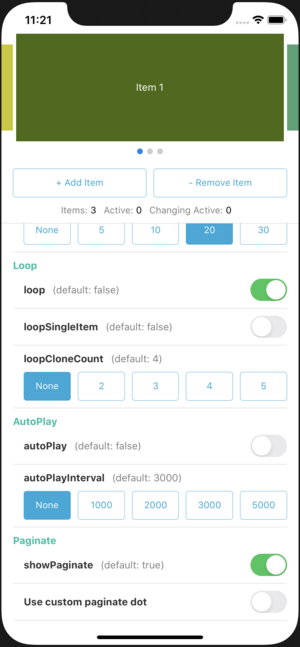

# React Native Bit Swiper 예제 (Examples)

이 문서는 React Native Bit Swiper 의 다양한 예제 및 코드를 제공합니다.

## 목차

- [`기본`](#기본)
- [`비활성 아이템 표시`](#비활성-아이템-표시)
- [`루프 (Loop)`](#루프-loop)
- [`자동 스크롤 (Autoplay)`](#자동-스크롤-autoplay)
- [`페이지 스타일`](#페이지-스타일)
- [`커스텀 페이지`](#커스텀-페이지)
- [`아이템 정렬`](#아이템-정렬)
- [`아이템 스케일 정렬`](#아이템-스케일-정렬)
- [`예제 프로그램`](#예제-프로그램)

## `기본`[⬆](#목차)
[`items`](ApiReference.md#items)에 아이템 목록을 설정하고,
[`onItemRender`](ApiReference.md#onitemrender) 에서 각 아이템의 UI를 그립니다.


```javascript
<BitSwiper
  items={['Item 1', 'Item 2', 'Item 3']}
  onItemRender={(item, index) => (
    <View style={{height: 200}}>
      <Image
        source={Images[index]}
        style={{width: '100%', height: '100%'}}
      />
    </View>
  )}
/>
```

> 관련 Props :
> [`initItemIndex`](ApiReference.md#inititemindex)
> [`items`](ApiReference.md#items)
>
> 관련 Events :
> [`onItemRender`](ApiReference.md#onitemrender)
> [`onItemIndexChange`](ApiReference.md#onitemindexchange)
> [`onItemIndexChanging`](ApiReference.md#onitemindexchanging)
 
> 전체 소스 : [`/docs/examples/Basic.js`](examples/Basic.js)

## `비활성 아이템 표시`[⬆](#목차)
[`itemWidth`](ApiReference.md#itemwidth)
[`inactiveItemScale`](ApiReference.md#inactiveitemscale)
[`inactiveItemOpacity`](ApiReference.md#inactiveitemopacity)
[`inactiveItemOffset`](ApiReference.md#inactiveitemoffset) 값을 설정하여, 좌우에 비활성 아이템을 표시할 수 있습니다.


```javascript
<BitSwiper
  items={['Item 1', 'Item 2', 'Item 3']}
  itemWidth="80%" // 활성 아이템의 넓이
  inactiveItemScale={0.8} // 비활성 아이템의 스케일
  inactiveItemOpacity={0.5} // 비활성 아이템의 투명도
  inactiveItemOffset={30} // 비활성 아이템 표시 넓이
  onItemRender={(item, index) => (
    <View style={{height: 150}}>
      <Image
        source={Images[index]}
        style={{width: '100%', height: '100%'}}
      />
    </View>
  )}
/>
```

> 관련 Props :
> [`itemWidth`](ApiReference.md#itemwidth)
> [`activeItemScale`](ApiReference.md#activeitemscale)
> [`activeItemOpacity`](ApiReference.md#activeitemopacity)
> [`inactiveItemScale`](ApiReference.md#inactiveitemscale)
> [`inactiveItemOpacity`](ApiReference.md#inactiveitemopacity)
> [`inactiveItemOffset`](ApiReference.md#inactiveitemoffset)

> 전체 소스 : [`/docs/examples/Inactive.js`](examples/Inactive.js)

## `루프 (Loop)`[⬆](#목차)
[`loop`](ApiReference.md#loop)를 `true`로 설정하면, 좌우로 무한히 스크롤할 수 있는 루프 기능을 사용할 수 있습니다.

[`loopSingleItem`](ApiReference.md#loopsingleitem)을 `true`로 설정하면, 아이템이 1개 일 때 루프를 적용할 수 있습니다.


```javascript
<BitSwiper
  items={['Item 1', 'Item 2', 'Item 3']}
  itemWidth="80%"
  inactiveItemScale={0.8}
  inactiveItemOpacity={0.5}
  inactiveItemOffset={30}
  loop // 루프 사용
  loopSingleItem // 아이템이 1개 일때 루프 사용
  onItemRender={(item, index) => (
    <View style={{height: 150}}>
      <Image
        source={Images[index]}
        style={{width: '100%', height: '100%'}}
      />
    </View>
  )}
/>
```

> 관련 Props :
> [`loop`](ApiReference.md#loop)
> [`loopSingleItem`](ApiReference.md#loopsingleitem)
> [`loopCloneCount`](ApiReference.md#loopclonecount)

> 전체 소스 : [`/docs/examples/Loop.js`](examples/Loop.js)

## `자동 스크롤 (Autoplay)`[⬆](#목차)
[`autoplay`](ApiReference.md#autoplay)를 `true`로 설정하면, 자동 스크롤 기능을 사용할 수 있습니다.

[`autoplayDelay`](ApiReference.md#autoplaydelay)
[`autoplayInterval`](ApiReference.md#autoplayinterval) 값으로 자동 스크롤 시간 간격을 설정할 수 있습니다.

***루프를 적용하지 않은 자동 스크롤***


***루프를 적용한 자동 스크롤***


```javascript
<BitSwiper
  items={['Item 1', 'Item 2', 'Item 3']}
  itemWidth="80%"
  inactiveItemScale={0.8}
  inactiveItemOpacity={0.5}
  inactiveItemOffset={30}
  loop
  autoplay // 자동 스크롤 사용
  autoplayDelay={1000} // 자동 스크롤 최초 대기 시간 (1초)
  autoplayInterval={1000} // 자동 스크롤 시간 간격 (1초)
  onItemRender={(item, index) => (
    <View style={{height: 150}}>
      <Image
        source={Images[index]}
        style={{width: '100%', height: '100%'}}
      />
    </View>
  )}
/>
```

> 관련 Props :
> [`autoplay`](ApiReference.md#autoplay)
> [`autoplayDelay`](ApiReference.md#autoplaydelay)
> [`autoplayInterval`](ApiReference.md#autoplayinterval)

> 전체 소스 : [`/docs/examples/Autoplay.js`](examples/Autoplay.js)

## `페이지 스타일`[⬆](#목차)
[`paginateStyle`](ApiReference.md#paginatestyle)
[`paginateDotStyle`](ApiReference.md#paginatedotstyle)
[`paginateActivDotStyle`](ApiReference.md#paginateactivdotstyle) 값을 설정하여, 페이지를 다양하게 표시할 수 있습니다. 


```javascript
<BitSwiper
  items={['Item 1', 'Item 2', 'Item 3']}
  itemWidth="80%"
  inactiveItemScale={0.8}
  inactiveItemOpacity={0.5}
  inactiveItemOffset={30}
  loop
  // 페이지 스타일
  paginateStyle={{
    marginTop: -20,
  }}
  // 도트 스타일
  paginateDotStyle={{
    backgroundColor: 'rgba(0, 0, 0, .5)',
    width: 10,
    height: 10,
    borderRadius: 5,
    marginHorizontal: 3,
  }}
  // 활성 도트 스타일
  paginateActiveDotStyle={{
    backgroundColor: 'rgba(255, 255, 255, .8)',
    width: 10,
    height: 10,
    borderRadius: 5,
    marginHorizontal: 3,
  }}
  onItemRender={(item, index) => (
    <View style={{height: 150}}>
      <Image
        source={Images[index]}
        style={{width: '100%', height: '100%'}}
      />
    </View>
  )}
/>
```

> 관련 Props :
> [`paginateStyle`](ApiReference.md#paginatestyle)
> [`paginateDotStyle`](ApiReference.md#paginatedotstyle)
> [`paginateActivDotStyle`](ApiReference.md#paginateactivdotstyle)

> 전체 소스 : [`/docs/examples/Paginate.js`](examples/Paginate.js)

## `커스텀 페이지`[⬆](#목차)
[`onPaginateDotRender`](ApiReference.md#onpaginatedotrender) 이벤트를 활용하여, 커스텀 페이지를 구성할 수 있습니다.

이 이벤트를 설정하면,
[`paginateDotStyle`](ApiReference.md#paginatedotstyle)
[`paginateActivDotStyle`](ApiReference.md#paginateactivdotstyle) 설정은 무시됩니다.


```javascript
<BitSwiper
  ref={swiperRef}
  items={['Item 1', 'Item 2', 'Item 3']}
  itemWidth="80%"
  inactiveItemScale={0.8}
  inactiveItemOpacity={0.5}
  inactiveItemOffset={30}
  loop
  onItemRender={(item, index) => (
    <View style={{height: 150}}>
      <Image
        source={Images[index]}
        style={{width: '100%', height: '100%'}}
      />
    </View>
  )}
  // 커스텀 페이지 render
  onPaginateDotRender={(index, active) => (
    <TouchableOpacity
      activeOpacity={0.7}
      style={active ? styles.customActiveDot : styles.customDot}
      onPress={() => {
        if (swiperRef.current) {
          swiperRef.current.activeItem(index);
        }
      }}>
      <Text
        style={active ? styles.customActiveDotText : styles.customDotText}>
        {index + 1}
      </Text>
    </TouchableOpacity>
  )}
/>

const styles = StyleSheet.create({
  customDot: {
    backgroundColor: 'rgba(0, 0, 0, .3)',
    width: 20,
    height: 20,
    borderRadius: 10,
    marginHorizontal: 3,
    alignItems: 'center',
  },
  customDotText: {
    color: 'white',
    lineHeight: 20,
  },
  customActiveDot: {
    backgroundColor: '#f18904',
    width: 20,
    height: 20,
    borderRadius: 10,
    marginHorizontal: 3,
    alignItems: 'center',
  },
  customActiveDotText: {
    color: 'white',
    lineHeight: 20,
    fontWeight: 'bold',
  },
});
```

> 관련 Events :
> [`onPaginateDotRender`](ApiReference.md#onpaginatedotrender)
> [`paginateStyle`](ApiReference.md#paginatestyle)
> [`paginateDotStyle`](ApiReference.md#paginatedotstyle)
> [`paginateActivDotStyle`](ApiReference.md#paginateactivdotstyle)

> 전체 소스 : [`/docs/examples/CustomPaginate.js`](examples/CustomPaginate.js)

## `아이템 정렬`[⬆](#목차)
각 아이템의 높이가 다른 경우, [`itemAlign`](ApiReference.md#itemalign) 값을 설정하여 어느 위치로 기준할지 정할 수 있습니다. 

***상단 정렬***


***중간 정렬***



***하단 정렬***


```javascript
<BitSwiper
  items={['Item 1', 'Item 2', 'Item 3']}
  itemWidth="80%"
  itemAlign="top" // 정렬 위치 (top, middle, bottom)
  inactiveItemOffset={30}
  loop
  onItemRender={(item, index) => (
    <View style={{height: [150, 180, 200][index]}}>
      <Image
        source={Images[index]}
        style={{width: '100%', height: '100%'}}
      />
    </View>
  )}
/>
```

> 관련 Props :
> [`itemAlign`](ApiReference.md#itemalign)

> 전체 소스 : [`/docs/examples/ItemAlign.js`](examples/ItemAlign.js)

## `아이템 스케일 정렬`[⬆](#목차)
[`activeItemScale`](ApiReference.md#activeitemscale)
[`inactiveItemScale`](ApiReference.md#inactiveitemscale) 로 스케일을 지정했을 경우,
[`itemScaleAlign`](ApiReference.md#itemscalealign) 값을 설정하여 어느 위치로 기준할지 정할 수 있습니다.

***상단 정렬***


***중간 정렬***


***하단 정렬***


```javascript
<BitSwiper
  items={['Item 1', 'Item 2', 'Item 3']}
  itemWidth="80%"
  itemScaleAlign="middle" // 정렬 위치 (top, middle, bottom)
  inactiveItemScale={0.8}
  inactiveItemOffset={30}
  loop
  onItemRender={(item, index) => (
    <View style={{height: 150}}>
      <Image
        source={Images[index]}
        style={{width: '100%', height: '100%'}}
      />
    </View>
  )}
/>
```

> 관련 Props :
> [`itemScaleAlign`](ApiReference.md#itemscalealign)
> [`activeItemScale`](ApiReference.md#activeitemscale)
> [`inactiveItemScale`](ApiReference.md#inactiveitemscale)

> 전체 소스 : [`/docs/examples/ItemScaleAlign.js`](examples/ItemScaleAlign.js)

## `예제 프로그램`[⬆](#목차)
iOS, Android 예제프로그램을 통해, 이 컴포넌트에서 제공하는 다양한 기능을 실시간으로 옵션을 변경하며 확인할 수 있습니다.



- iOS 실행
```
$ cd RNBitSwiperExample
$ yarn install
$ cd ios && pod install && cd ..
$ react-native start
$ react-native run-ios
```

- Android 실행
```
$ cd RNBitSwiperExample
$ yarn install
$ react-native start
$ react-native run-android
```

> 전체 소스 : [`/RNBitSwiperExample`](../RNBitSwiperExample)

## 다른 문서

- [API 명세서 (API Reference)](./ApiReference.md) : 사용 가능한 Props, Event, Method 에 대한 상세 정보를 제공합니다.
